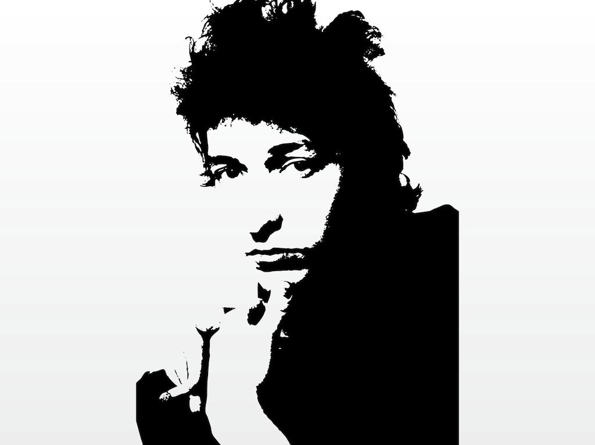

# Bob Dylan Lyrics Generator

Please enjoy the generator of Bob Dylan's lyrics.

One of my favorite bits:

> Sara Bello, a.k.a. Sara Corso\
Was born on May 7, 1889 in Belize City, Belize\
She is the daughter of a Spanish diplomat and a Spanish convict\
She is of Arab and Spanish blood\
She wears an Arabic ring with her name carved on it\
She is said to hold a wedding cake\
She is best known for playing the role of Queen Beatrix of the Spanish Ballons\
But she also appeared in the very popular children's book, Alarm Clock\
Sara Bello, she's a Spanish princess

The generated bits are often messy so you may need to generate multiple times to get a quality full song lyrics, but I hope this gives you an idea of what could be achieved.

Colab link: https://colab.research.google.com/drive/16n8csa0v1UhB1KnnXS7TuDscflk5RHAk#scrollTo=QJOFG7J0VadI

Inspiration: https://medium.com/@gs.chauhan/i-made-an-ai-listen-to-100-led-zeppelin-songs-and-told-it-to-write-one-6f06ce8ccabc

Portrait: FreeVector
